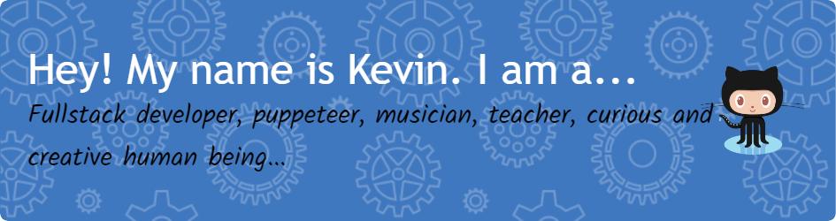

<!--  -->
## Full Stack Web Developer | Based in Austin, Texas 

#### With a background in the performing arts and education, I bring the passion and creativity of an artist, along with the patient persistence, and skilled communication of a teacher, to my work as a software engineer.

#### I thrive on creative problem-solving and collaboration. I love the challenge of attempting to answer the question, "What if...?"

## Currently 

#### Pursuing Freelance Work
If you are in need of a website or app for your creative project, small business, or organization, I would love to talk!

#### Seeking Fulltime Employment
As a developer, I am looking for a company that values creativity, collaboration, and a passion for learning.

#### Teaching (Assistant) - edX - Full Stack Web Development Bootcamp
I love helping students learn and grow, and I am excited to continue to do so in this role.

#### Seeking New Tech Connections
I am always looking to meet new people in the tech community. If you are a developer, designer, or tech professional, I would love to connect!

  

  

  

<!-- 

  

 -->

  ⚡I’m currently working on:⚡ 
  <ul >
    <li>⚡<a href='https://vainmainstream.com'>vainmainstream.com</a>⚡</li>
    <li>⚡<a href='https://klong75.github.io/sam-hahn-travel/'>A new website for Sam Hahn Travel Company</a>⚡</li>
    <li>⚡<a href='https://kevinlong.dev'>A new portfolio website for myself</a>⚡</li> 
    
  </ul>

<!--
**KLong75/KLong75** is a ✨ _special_ ✨ repository because its `README.md` (this file) appears on your GitHub profile.

Here are some ideas to get you started:

- 🔭 I’m currently working on ...
- 🌱 I’m currently learning ...
- 👯 I’m looking to collaborate on ...
- 🤔 I’m looking for help with ...
- 💬 Ask me about ...
- 📫 How to reach me: ...
- 😄 Pronouns: ...
- ⚡ Fun fact: ...

-->
